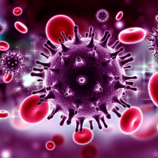

# Seminario_Fuentes_WAM
### Autoras: Amina Khantimirova, Wiam Messari y Emma Arrieta
### 2º Ingeniería de la Salud. Seminario A

## Introducción
El **VIH** hace referencia al virus de la inmunodeficiencia humana. Daña el sistema inmunitario del individuo al destruir un tipo de glóbulo blanco que ayuda a su cuerpo a combatir las infecciones. Esto lo pone en riesgo de tener otras infecciones y enfermedades.

Esta enfermedad afecta a un gran porcentaje de la población española, resultando en un foco de malestar. En este seminario estudiaremos aquellos indicativos que potencian la expresión de dicha enfermedad. 

Nuestro primer foco de interés es estudiar la correlación entre la orientación sexual y el VIH, pero también incluiremos otros factores de riesgo que podrían desencadenar dicho virus.

## Objetivos generales
- Concienciar a la población española de los diferentes desencadenantes que pueden llevar a contraer el VIH, ya que en su mayoría son evitables.

- Conocer mediante el estudio de tablas la correlación que puede llegar a existir entre entre la orientación sexual de un individuo y su predisposición a contraer la enfermedad del VIH.

## Objetivos específicos
1. ¿La conducta sexual resulta un factor de riesgo para el VIH?
2. Relación existente entre el uso de preservativo y el desarrollo del VIH.
3. Relación existente entre el promedio de parejas y el desarrollo del VIH.
4. ¿Cuál es la evolución del impacto de la enfermedad en la población desde 2013 a 2023?
5. ¿Hay más casos de VIH cuanto mayor es la población?
6. Estudio anual de nuesvas infecciones.
7. Factores de riego generales y su influencia en el desarrollo del VIH.
8. ¿Cuál es la comunidad autónoma con más casos de VIH en 2023 por conducta homosexual? ¿Y heterosexual?

## Metodología y resultados

Para este seminario empleamos una mezcla de distintos tipos de datos, parte de ellos fueros obtenidos de bases de datos provenientes del gobierno de Castilla y Leon 
mientra que la inmensa mayoría fueron sacadas de un estudio muy profundizado que, al igual de nosotros, estudiaba 
el virus del VIH y los diversos factores que la desencadenan. En la conclusión realizada por el Gobierno de España se llegó a nuestra misma conclusión, las relaciones sexuales
son el mayor desncadenante.

Nuestros datos son variados, tenemos JSON, CSV y ODS. Por ello usamos distintas librerías de R (readr, read_csv, rjson... )

En el estudio podemos apreciar el uso de diferentes formas de union de tabla, que nos ayudaron a comprender los datos mejor, 
destacando el uso full join y left join. Estas herramientas fueron muy importantes para la realización del seminario.

A medida que desarrollábamos el seminario fuimos recogiendo y mencionando pequeñas conclusiones a las que llegábamos.

Al final vemos como el porcentaje de casos VIH en la población española han disminuido drásticamente, notando un  mínimo en los años 2019-2020 que coinciden con los años de la pandemia, cuando el contacto humano se vió reducido. 

Cabe destacar que los hombres han sido los proganistas de este estudio, llevando la delantera en todos los estudios realizados, tanto en aquellos dirigidos a contar el número de parejas anual como a los que marcaban los casos de VIH positivo, esto provocó dificultad para esclarecer si dichos datos son extrapolables o si han sido condicionadas.

Esto es debido a que el número de parejas en sí es un factor de riesgo para el VIH, y el sexo masculino muestra predisposición en los estudios. Por lo tanto, no sabemos si el número de parejas tiene efecto en el desarrollo del virus, o si se ve condicionada por el hecho de que se trata del sexo masculino.

En general, las relaciones HSH han llevado la delantera en todos los estudios, por lo que ha satisfecho nuestra hipótesis inicial. Aunque cabe mencionar que nuetsro objetivo era más amplio, pero nuetsro foco principal radicaba en estas.

## Conclusiones generales
La principal conclusión es que el esfuerzo de prevención y control epidemiológico debe seguir centrándose en las prácticas de riesgo sexual (HSH y Heterosexual), ya que son las vías responsables de la mayoría de las nuevas infecciones por VIH registradas en el periodo 2013-2022.
Dentro de las prácticas de riesgo sexual debemos destacar las relaciones HSH, que fueron nuestro objeto principal en el estudio.

Mediante la comparativa de gráficas y diversas tablas hemos llegado a la conclusión de que hay una correlación importante entre el desarrollo del VIH y las relaciones HSH.
Es por ello que creemos necesario una concienciación respecto a las enfermedades de transmisión sexual, ya que, como queríamos probar en al inicio de este seminario, una inmensa mayoría de los casos son prevenibles aplicando el cuidado necesario y responsabilizandose de la salud, no solo propia, sino del colectivo Español.

Al mismo tiempo,nos gustaría mencionar la alta proporción de casos con motivo de transmisión Desconocido, esto nos indica una necesidad de mejorar los métodos de recolección de datos. De esta manera tendremos bases de datos más completas y los estudios podrán realizarse con mayor precisión en el futuro.

## Referencias
- Sec. (n.d.). Encuesta de Anticoncepción en España 2024. Sociedad Española De Contracepción. Retrieved October 15, 2025, from https://sec.es/encuesta-de-anticoncepcion-en-espana-2024/
- Uso de preservativo y número de parejas sexuales en hombres que tienen sexo con hombres con sífilis. (n.d.). Retrieved October 15, 2025, from https://www.actasdermo.org/es-pdf-S0001731010003364
- Unidad de vigilancia de VIH, ITS y hepatitis. (2024). VIGILANCIA EPIDEMIOLÓGICA DEL VIH y SIDA EN ESPAÑA 2023. In Centro Nacional de Epidemiología, Instituto de Salud Carlos III/ División de control de VIH, ITS, Hepatitis virales y tuberculosis, & Ministerio de Sanidad, SISTEMA DE INFORMACIÓN SOBRE NUEVOS DIAGNÓSTICOS DE VIH REGISTRO NACIONAL DE CASOS DE SIDA [Report]. https://www.sanidad.gob.es/ciudadanos/enfLesiones/enfTransmisibles/sida/vigilancia/docs/Informe_VIH_SIDA_2023_Nov_2024_def.pdf
- National Library of Medicine. (n.d.). VIH. Retrieved October 16, 2025, from https://medlineplus.gov/spanish/hiv.html
- De Castilla y León, J. (s. f.). Datos abiertos de Castilla y León. Datos Abiertos. https://datosabiertos.jcyl.es/web/es/datos-abiertos-castilla-leon.html

__Aquí están las herramientes empleadas para saber realizar el código de Shiny:__

- __Temario consultado para saber como usar shiny__ : RPubs - Introducción a Shiny. (s. f.). https://www.rpubs.com/JohanMarin/Shiny

- __Temario de ampliación sobre como usar shiny__ : 
  Custom Bootstrap Sass Themes for shiny and rmarkdown. (s. f.). https://rstudio.github.io/bslib/

- Apply a function to each element of a vector — map. (s. f.).           https://purrr.tidyverse.org/reference/map.html

- Ryan, Y. (2022, 19 octubre). Creación de aplicaciones web interactivas con R y Shiny. Programming Historian. https://programminghistorian.org/es/lecciones/creacion-de-aplicacion-shiny
Strayer, N. (s. f.). Shiny. Shiny. https://shiny.posit.co/r/articles/build/css/

